I will keep some notes here
Only index.html is related to the developing project.

# Basic action

## reflog

It is different from "git log". "git log" is the real status now. If "reset" has been used to get back to a former version, "git log" could not show the latest version. But "git reflog" will show all the progress you have made.

For example, if you use "git reset --hard" to get back to "function two", with "git reflog" you can see:
```
e77553c (HEAD -> master) HEAD@{0}: reset: moving to e77553c4022921963f680c1c5e9b4cf5df9e1e26
10f5755 HEAD@{1}: commit: feat(index): add fucntion three
e77553c (HEAD -> master) HEAD@{2}: commit: feat(index): add fucntion two
d30d98e HEAD@{3}: commit: adjust(dbhot): adjust the structure of the project and let this be the first version
```

But with "git log", you cannot see function three anymore. So using "git reflog" to check id, you can still get back to function three.

## git status change
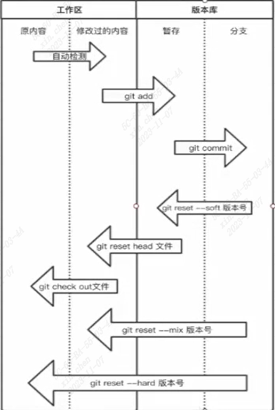

Some of these actions can be seen from "git status" as instructions.

## branch
The default branch (master) should be the published project.

When developing a new feature, use a new branch

When bugs appear, use a new branch

When finished developing or debugging, merge the branch.

An example:
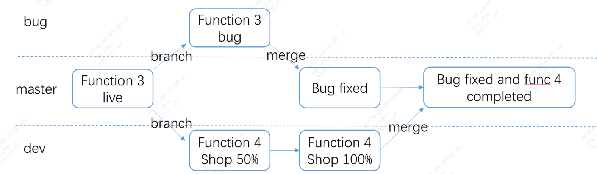

list branch
```bash
git branch
```

create new branch "bug": (the same as "dev")
```bash
git branch bug
```

switch to branch "bug": 
```bash
git checkout bug
```
Actually, the action create and switch can be done by one command:
```bash
git checkout -b bug
```
**These creating processes are based on current branch, based on 'master' in this case. This should be noticed because creating action needs a base, that is, "create from which".**

After fixed, merge the branch. **Switch to master first, then merge.**
```bash
git branch master
git merge bug
```
Then, delete the bug branch
```bash
git branch -d bug
```
But when merging branch "dev", it will show conflict. Because something in func 3 has been changed in branch "bug", but those have not been changed in branch "dev". Having modified the conflict files, add and commit those will solve the problem.

## online repo (push)
Give repo a name to be used locally. Normally, it is "origin".

```bash
git remote add origin https://github.com/BigCircle100/dbhot.git
```
For the first time of pushing code, use "-u" to bind the local branch in online repo. The online repo will have the same branch.
```bash
git push -u origin master
```
Also, using 'git push origin master' will only push the 'master' branch. If you use this on 'dev' branch, it will still push 'master' to the online repo.

## clone

After cloning the code, the local code contains all the branch, although "git branch" might not seen all of them. Just use "git checkout" to switch branch.

The process of "giving repo a name" has been done by default after you clone the code. You can use "origin" directly.

## about developing
When the "dev" has been merged to "master", the "dev" has not been updated to as same latest as "master". So before any development start, switch to "dev" and merge "master" first. It will ensure the "dev" is based on the latest "master" version.

## pull

```bash
git pull origin dev
# is equal to
git fetch origin dev
git merge origin/dev
```
"fetch" download the dev code to local repo. "merge" combine it with local workspace. Notice: "merge" is using "origin/dev" because it refers to only the "dev" branch of the whole repo (origin).

## rebase

### 1. Combine multiple **commit records** into one.

It is quite useful if you want to simplify the commit history or other people do not need those details.

**note:** In this case, do not rebase what has been pushed to online repo.

For example, here are 4 records and I want to combine the latest three.

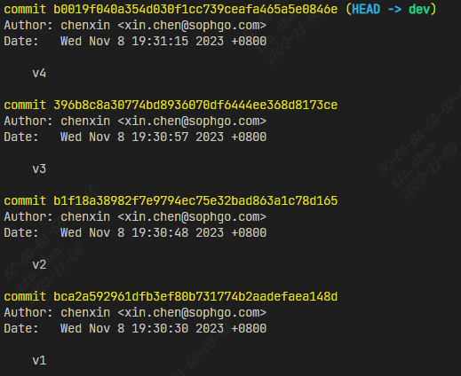

Use "rebase" like:

```bash
git rebase -i HEAD~3
```
Then there will be a rebase log showing about these three records with some instructions. Modifying the v3 and v4 commands to "s" to combine v2~v4 commit. Like:

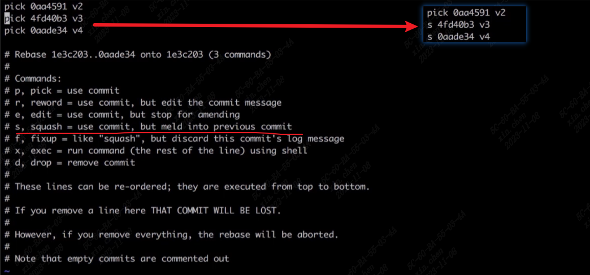

After saving this, another log with commit message will be shown, just modify it.

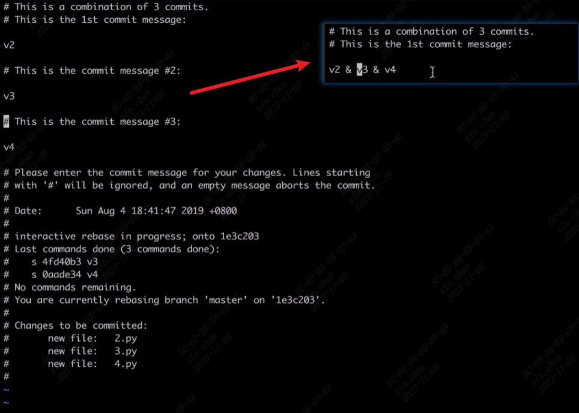

Finally, "git log" will be shown like:

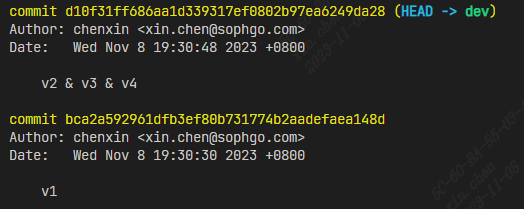

And it is done.

**note:** Once again, in this case, do not rebase what has been pushed to online repo.

### 2. reduce amount of branch locally

In this case, you can compare it with "merge".

```bash
# this can show the graph of commit log
git log --graph
```

- **Merge:** 

The steps are:

On 'dev' branch, create dev.py and commit

On 'master' branch, create master.py and commit

On 'master' branch, merge dev

The progress can be shown like:

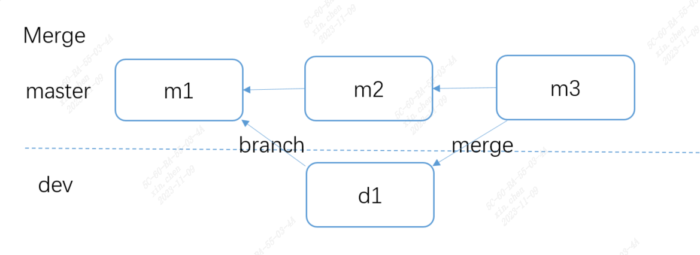

And log will be shown like: (with branch)

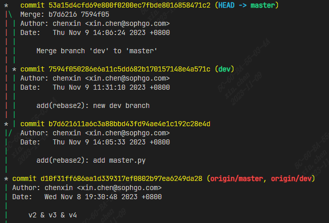

(before other further action, merge 'master' to 'dev' to keep 'dev' update)

- **Rebase:**

The steps are:

On 'dev' branch, create dev1.py and commit

On 'master' branch, create master1.py and commit

Switch to 'dev' branch, use:
```bash
git rebase master
```
Switch to 'master' branch, merge 'dev'

The progress can be shown like:

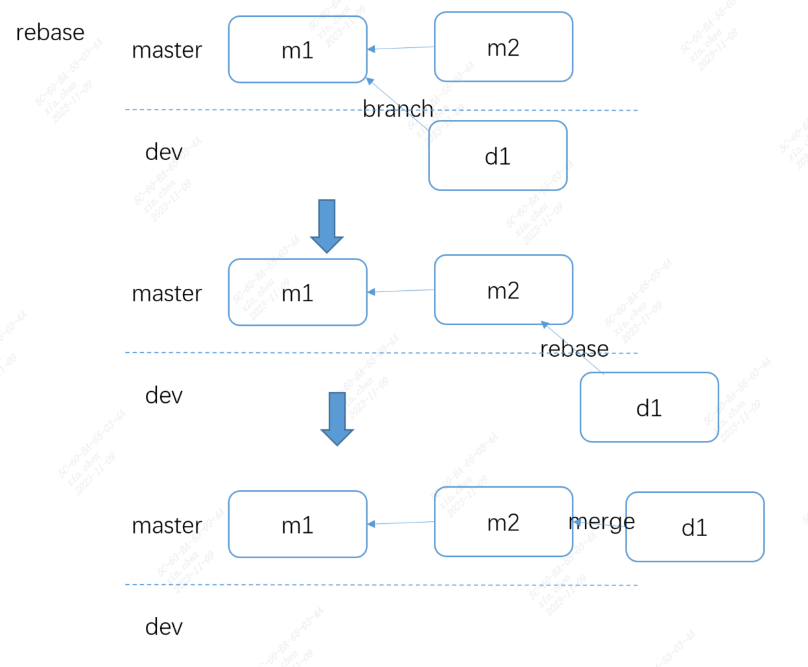

And log will be shown like: (a single line)

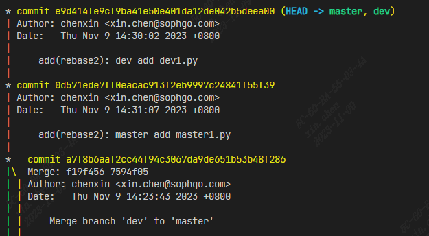

It seems that using 'git rebase master' on 'dev' branch will change the base of 'dev' commit to the latest 'master', and 'master' should merge the 'dev' commit at last to bring 'dev' to its branch. But this time, 'dev' does not need to merge 'master' to keep update, because the 'Head' of dev is pointing at the latest commit all the time.

### 3. reduce amount of branch while pulling from online repo

The senario is like:

While you are developing on 'dev', other people have already pushed their code on 'dev', so before you are pushing code, you need to update your local code.

Normally, 'git pull' can satisfy the demand, but it will generate log with branch. To avoid this, you can use 'git fetch origin dev' to download the latest code to your local repo, then using 'git rebase origin/dev' instead of 'git merge origin/dev'.


### 3. conflicts while rebasing

If there are conflicts while rebasing, 'git status' will be shown like: 

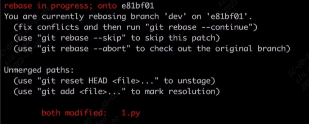

There are instructions about the rebasing status and what you should do:

Modify the files with conflicts. Add the modified files. And:
```bash
git rebase --continue
```

# Developing with multi-people


## tag version

You might have probably seen some version information like "v1.1.0", but the commit history shown before is hash value. Using 'tag' can add version information, and a 'tag' option can be seen in tab bar on online repo.

```bash
git tag -a v1 -m "v1.0"
```
It will tag 'v1.0' on the latest commit. Like:

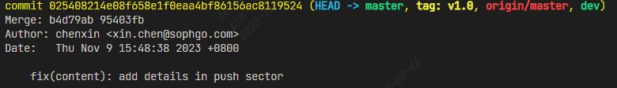

```bash
git push origin --tags
```
It will push the tag info.

In the online repo, you can see the tag info:

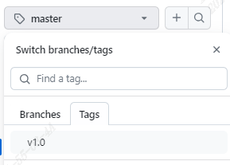

Also, through the tag part, you can download different version.

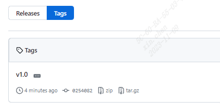

## Gitflow

There is a gitflow shows the basic process when developing with many people.

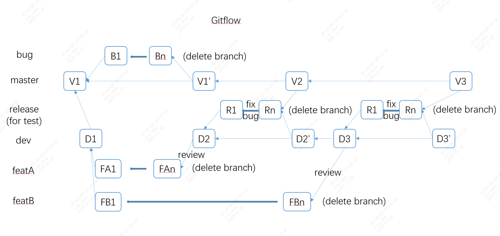

Master: The version that has been launched. 

Bug: The branch to fix the bug on 'master'. Usually, it will be deleted after bug has been fixed.

Dev: The main branch of development. If new feature has been developed, it will be merged to this branch after code review. Usually, it belongs to the administrator.

Feat: The branch to develop the new feature. Usually, it will be deleted after the development and it belongs to a single developer or a specific team. This can still be divided further and the structure will be like the relation between 'dev' and 'feat'.

Release: This branch is for the tests of new 'dev'. Usually, it will be deleted after test.

One thing need to notice is that:

V1 -> D1 (D1->FA1 or D1->FA2) is achieved by making new branch from V1 (D1), and when those new branches are pushed, the online repo will have these branch as well.

## Inviting other developers

### Personal repo

click settings -> collaborators -> send email

### Organization

create organization -> (invite members) -> create repo

You can invite members anytime and choose whether he/she is owner or member.

Use 'settings' to manage authority. It has different settings in organization and each repo.


## code review

Give rules to branch:

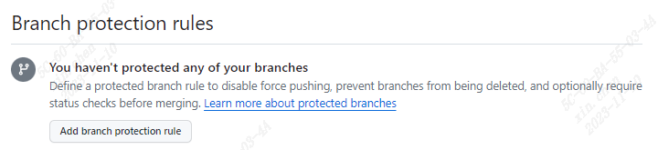

Including pull(merge) request. This is the code review process.

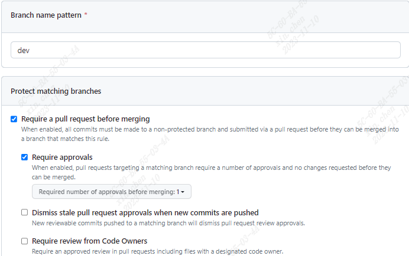

After the members has pushed the new commit, they can find a "pull request" button and add some comments to inform owner or administrator to review.


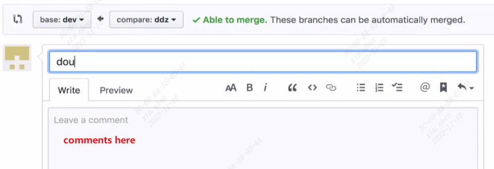

The owner could add review on this request and decide whether to merge.

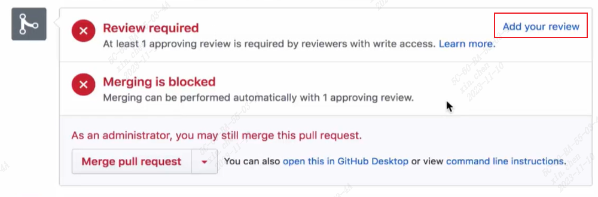

And after merged, there will be a "delete branch "button, which is mentioned in the "gitflow" section.

## release

When 'release' has tested the 'dev', the owner can merge it to 'master' directly, or it use 'pull request'. And after this, it can have a new tag like 'v2.0'. Using what mentioned in "tag version" section.

# Contribute code to open source

1. fork other's repo: this will copy other's repo to your repo (online)
2. pull code, develop, commit, push: finally, all the modification is appeared in your online repo 
3. send a pull request to authorship

# Config

There are three git config files. You can check these files directly. The order of checking config is "local -> global -> system". The difference is about the parameter of "git config".

## local

This is a repo (project) config file, only available in this repo. The path is "(repo)/.git/config".

```bash
git config --local xxx

#eg:
git config --local user.name 'xxx'
git config --local user.email 'xxx@xx.com'
```
One thing need to be noticed is that 'origin' representation is defined in this file while using this:

```bash
git remote add origin xxx
```
Reasonable isn't it?

## global

This setting is available for all the repo the local user has. The path is "~/.gitconfig".

```bash
git config --global xxx
```

## system

This setting is available for all the local user on this device. The path is "/etc/.gitconfig".

```bash
# needs root
git config --system xxx
```


# .gitignore

If something does not have to be uploaded or tracked, you can add it to the file '.gitignore'. File matching follows regex rules. If you add '!' before the file name, it means this file has been excluded.

For example, some uses might like this:

```
*.txt       # all txt files are ignored
ign/        # dir ign is ignored
!2.txt      # 2.txt is not ignored
```
In vscode, after adding the three lines above into '.gitignore', the repo will be shown like this: 

(Ignored files are shown in shadow, new uncommited files are in green, modified uncommited files are in brown, deleted files are in red)

(Just to show the function of '.gitignore')

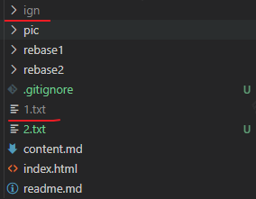

Some special cases require to ignore specific files related to different language (python/C++...). Github offers some reference about this: https://github.com/github/gitignore

# Task management

## issues
Using 'issues' can keep all the common problems or bugs together. Also, it can be classified.

Add 'issues':

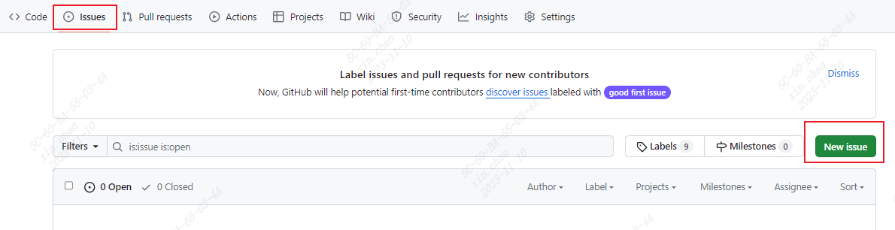

Write discriptions. Choose members to deal with it. Add labels (bug/...) After it has been posted, everyone can make comments on it.

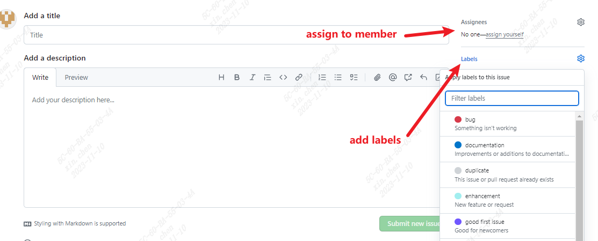

On the main issues page, you can see all the issues. You can filter them by different categories (labels/assignee/...)

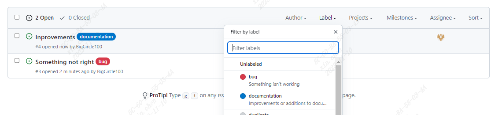


## wiki

On the wiki page, you can add some descriptions about your repo. And that's all.